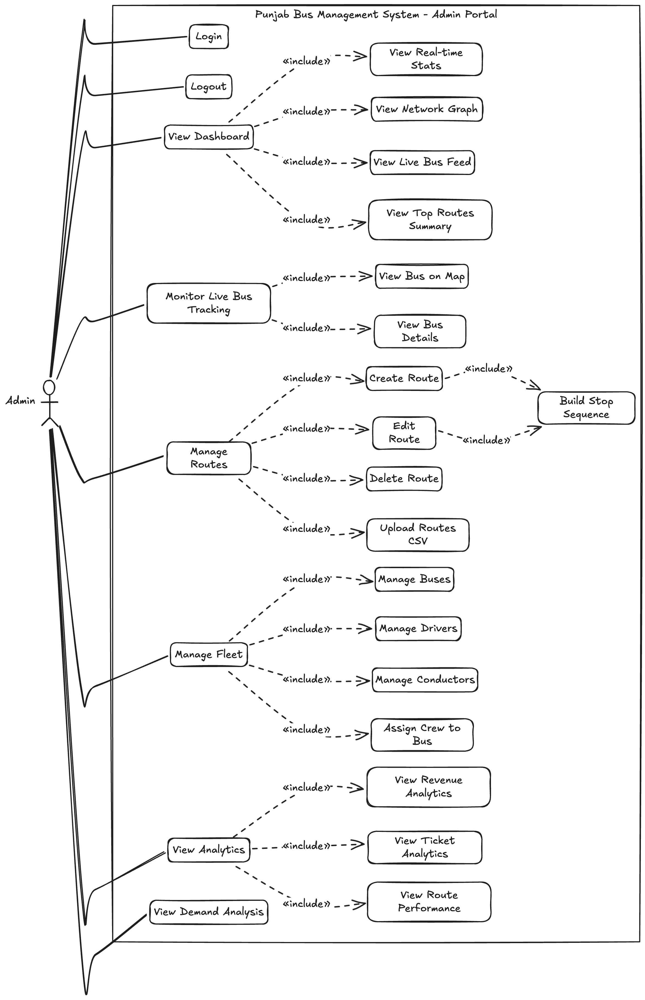
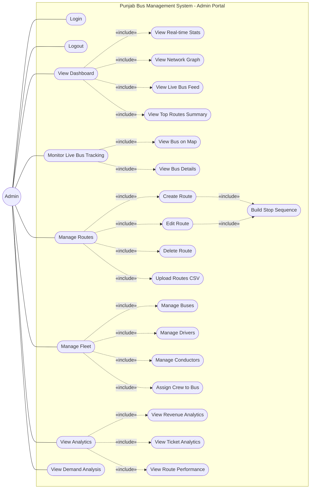

# Use Case Diagram

## NextStop — Government Bus Tracking & Fleet Management System

### Admin Portal — Unified Use Case Diagram

This Use Case Diagram illustrates the functional scope of the **NextStop Admin Portal**. It visualizes the primary actor (Admin), the core system functionalities, their sub-actions via `«include»` relationships, and how they map to the six operational domains of the portal.

---

## Use Case Diagram

---

## Sub-System Domains Overview

The diagram natively groups into six logical domains:

1. **Authentication (Entry/Exit):** Use cases governing session lifecycle — `Login` and `Logout`.
2. **Dashboard & Monitoring (Overview):** The central real-time operations hub including `View Dashboard`, aggregated stats, network graph, live bus feed, and top route summaries.
3. **Live Tracking (Geospatial):** Use cases for GPS-based real-time bus monitoring on OLA Maps — `Monitor Live Bus Tracking`, map views, and bus detail inspection.
4. **Route Management (CRUD):** Full lifecycle management of transit routes — creation, editing, deletion, CSV bulk upload, and stop sequence building.
5. **Fleet Management (Personnel & Vehicles):** Management of physical assets and staff — buses, drivers, conductors, and crew-to-bus assignment.
6. **Analytics & Demand (Insights):** Data-driven decision support — revenue analysis, ticket analytics, route performance metrics, and passenger demand pattern analysis.

---

## Actor Summary

| Actor | Type | Description |
|-------|------|-------------|
| Admin | Primary | Government authority / system administrator who manages the entire bus fleet, routes, personnel, and reviews operational analytics through the Admin Portal |

---

## Use Case Summary

### Core Use Cases (26 Total — 8 Main, 18 Included)

| ID | Use Case | Type | Domain | Included By | Description |
|----|----------|------|--------|-------------|-------------|
| UC1 | Login | Main | Authentication | — | Admin authenticates with email and password to access the portal |
| UC2 | Logout | Main | Authentication | — | Admin ends the current session and is redirected to login |
| UC3 | View Dashboard | Main | Dashboard | — | Central operations hub showing real-time system overview |
| UC4 | View Real-time Stats | Include | Dashboard | UC3 | Displays 4 stat cards — active buses, active trips, today's revenue, tickets sold |
| UC5 | View Network Graph | Include | Dashboard | UC3 | Interactive canvas-rendered route network visualization |
| UC6 | View Live Bus Feed | Include | Dashboard | UC3 | Real-time scrolling feed of bus activity events |
| UC7 | View Top Routes Summary | Include | Dashboard | UC3 | Table showing best-performing routes by ticket volume |
| UC8 | Monitor Live Bus Tracking | Main | Live Tracking | — | Real-time GPS bus positions rendered on OLA Maps |
| UC9 | View Bus on Map | Include | Live Tracking | UC8 | Individual bus marker with position on the map interface |
| UC10 | View Bus Details | Include | Live Tracking | UC8 | Detailed bus info panel — speed, route, driver, status |
| UC11 | Manage Routes | Main | Route Management | — | Full CRUD operations for transit route definitions |
| UC12 | Create Route | Include | Route Management | UC11 | Add a new route with name, fare per km, and stops |
| UC13 | Edit Route | Include | Route Management | UC11 | Modify existing route details, stops, and fare |
| UC14 | Delete Route | Include | Route Management | UC11 | Remove a route from the system |
| UC15 | Upload Routes CSV | Include | Route Management | UC11 | Bulk import multiple routes via CSV file upload |
| UC16 | Build Stop Sequence | Include | Route Management | UC12, UC13 | Define ordered list of stops with name, GPS coordinates, and sequence number |
| UC17 | Manage Fleet | Main | Fleet Management | — | Unified management of buses, drivers, and conductors |
| UC18 | Manage Buses | Include | Fleet Management | UC17 | CRUD operations for bus records — registration, type, capacity, status |
| UC19 | Manage Drivers | Include | Fleet Management | UC17 | CRUD operations for driver records — name, phone, license, status |
| UC20 | Manage Conductors | Include | Fleet Management | UC17 | CRUD operations for conductor records — name, phone, license, status |
| UC21 | Assign Crew to Bus | Include | Fleet Management | UC17 | Link a specific driver and conductor to a bus for trips |
| UC22 | View Analytics | Main | Analytics | — | Data insights dashboard with charts and reports |
| UC23 | View Revenue Analytics | Include | Analytics | UC22 | Revenue breakdown charts with date-based filtering |
| UC24 | View Ticket Analytics | Include | Analytics | UC22 | Ticket statistics with stop-level and time-range filters |
| UC25 | View Route Performance | Include | Analytics | UC22 | Per-route performance metrics and ranking |
| UC26 | View Demand Analysis | Main | Demand Analysis | — | Hourly passenger demand patterns per route with bus allocation suggestions |

---

## Relationship Summary

### Actor-to-Use-Case Associations (8 Relationships)

| Actor | Use Case | Relationship Type | Description |
|-------|----------|-------------------|-------------|
| Admin | UC1 — Login | Association | Admin initiates login to access the portal |
| Admin | UC2 — Logout | Association | Admin ends the active session |
| Admin | UC3 — View Dashboard | Association | Admin views the real-time operations overview |
| Admin | UC8 — Monitor Live Bus Tracking | Association | Admin monitors buses on map |
| Admin | UC11 — Manage Routes | Association | Admin performs route CRUD operations |
| Admin | UC17 — Manage Fleet | Association | Admin manages buses, drivers, and conductors |
| Admin | UC22 — View Analytics | Association | Admin reviews analytics and reports |
| Admin | UC26 — View Demand Analysis | Association | Admin analyzes passenger demand patterns |

### Use-Case-to-Use-Case Relationships (18 «include» Relationships)

| Source Use Case | Target Use Case | Relationship | Description |
|-----------------|-----------------|--------------|-------------|
| UC3 — View Dashboard | UC4 — View Real-time Stats | «include» | Dashboard always loads real-time stat cards |
| UC3 — View Dashboard | UC5 — View Network Graph | «include» | Dashboard always renders route network graph |
| UC3 — View Dashboard | UC6 — View Live Bus Feed | «include» | Dashboard always shows live bus activity feed |
| UC3 — View Dashboard | UC7 — View Top Routes Summary | «include» | Dashboard always displays top routes table |
| UC8 — Monitor Live Bus Tracking | UC9 — View Bus on Map | «include» | Tracking page always renders bus markers on map |
| UC8 — Monitor Live Bus Tracking | UC10 — View Bus Details | «include» | Tracking page always shows bus detail panel |
| UC11 — Manage Routes | UC12 — Create Route | «include» | Route management includes ability to create routes |
| UC11 — Manage Routes | UC13 — Edit Route | «include» | Route management includes ability to edit routes |
| UC11 — Manage Routes | UC14 — Delete Route | «include» | Route management includes ability to delete routes |
| UC11 — Manage Routes | UC15 — Upload Routes CSV | «include» | Route management includes CSV bulk upload |
| UC12 — Create Route | UC16 — Build Stop Sequence | «include» | Creating a route requires defining stop sequence |
| UC13 — Edit Route | UC16 — Build Stop Sequence | «include» | Editing a route requires modifying stop sequence |
| UC17 — Manage Fleet | UC18 — Manage Buses | «include» | Fleet management includes bus CRUD |
| UC17 — Manage Fleet | UC19 — Manage Drivers | «include» | Fleet management includes driver CRUD |
| UC17 — Manage Fleet | UC20 — Manage Conductors | «include» | Fleet management includes conductor CRUD |
| UC17 — Manage Fleet | UC21 — Assign Crew to Bus | «include» | Fleet management includes crew assignment |
| UC22 — View Analytics | UC23 — View Revenue Analytics | «include» | Analytics includes revenue analysis view |
| UC22 — View Analytics | UC24 — View Ticket Analytics | «include» | Analytics includes ticket analysis view |
| UC22 — View Analytics | UC25 — View Route Performance | «include» | Analytics includes route performance view |

---

## Frontend Page Mapping

Each main use case maps directly to a dedicated page in the Next.js App Router:

| Use Case | Route | Page Component | Key Components Used |
|----------|-------|---------------|---------------------|
| UC1 — Login | `/login` | `app/login/page.js` | Login form with email/password |
| UC2 — Logout | — | `AuthContext.jsx` | `logout()` clears localStorage and redirects |
| UC3 — View Dashboard | `/` | `app/(dashboard)/page.js` | `StatsOverview`, `NetworkGraphView`, `LiveBusFeed`, `TopRoutesSummary` |
| UC8 — Monitor Live Bus Tracking | `/tracking` | `app/(dashboard)/tracking/page.js` | `OlaMap` (OLA Maps SDK) |
| UC11 — Manage Routes | `/routes` | `app/(dashboard)/routes/page.js` | `StopsBuilder`, CSV upload, route CRUD forms |
| UC17 — Manage Fleet | `/fleet` | `app/(dashboard)/fleet/page.js` | `CreateBusModal`, `EditBusModal`, `CreateDriverModal`, `EditDriverModal`, `CreateConductorModal`, `EditConductorModal` |
| UC22 — View Analytics | `/analytics` | `app/(dashboard)/analytics/page.js` | Chart.js / Recharts charts |
| UC26 — View Demand Analysis | `/demand-analysis` | `app/(dashboard)/demand-analysis/page.js` | `DemandChart`, `useDemandAnalysis` hook |

---

## API Endpoint Mapping

Each use case is powered by corresponding backend API endpoints:

| Use Case | HTTP Method | Endpoint | Service |
|----------|-------------|----------|---------|
| UC1 — Login | POST | `/admin/v1/auth/login` | `admin.service.ts` |
| UC4 — View Real-time Stats | GET | `/admin/v1/analytics/realtime` | `admin.service.ts` |
| UC8 — Monitor Live Bus Tracking | GET | `/admin/v1/buses/live` | `admin.service.ts` |
| UC10 — View Bus Details | GET | `/admin/v1/bus/:busId/track` | `admin.service.ts` |
| UC11 — Manage Routes | GET | `/admin/v1/routes` | `admin.service.ts` |
| UC12 — Create Route | POST | `/admin/v1/routes` | `admin.service.ts` |
| UC13 — Edit Route | PUT | `/admin/v1/routes/:id` | `admin.service.ts` |
| UC14 — Delete Route | DELETE | `/admin/v1/routes/:id` | `admin.service.ts` |
| UC15 — Upload Routes CSV | POST | `/admin/v1/routes/bulk-upload` | `upload.service.ts` |
| UC18 — Manage Buses | GET/POST/PUT/DELETE | `/admin/v1/fleet/buses[/:id]` | `admin.service.ts` |
| UC19 — Manage Drivers | GET/POST/PUT/DELETE | `/admin/v1/fleet/drivers[/:id]` | `admin.service.ts` |
| UC20 — Manage Conductors | GET/POST/PUT/DELETE | `/admin/v1/fleet/conductors[/:id]` | `admin.service.ts` |
| UC21 — Assign Crew to Bus | POST | `/admin/v1/fleet/buses/:id/assign-crew` | `admin.service.ts` |
| UC23 — View Revenue Analytics | GET | `/admin/v1/analytics/revenue?date=YYYY-MM-DD` | `admin.service.ts` |
| UC24 — View Ticket Analytics | GET | `/admin/v1/analytics/tickets` | `admin.service.ts` |
| UC25 — View Route Performance | GET | `/admin/v1/analytics/route-performance` | `admin.service.ts` |
| UC26 — View Demand Analysis | GET | `/admin/v1/analytics/demand?route_id=...` | `admin.service.ts` |

---

## Notes

1. **Actor Scope:** This diagram covers only the **Admin Portal** actor. The full NextStop system also serves Passengers (mobile app) and Conductors (conductor app), which have separate use case scopes and are not represented here.
2. **«include» Relationship:** Indicates that the base use case **always** invokes the included use case as part of its execution. For example, `View Dashboard` always includes loading `View Real-time Stats`.
3. **Shared Include — Build Stop Sequence (UC16):** This use case is included by both `Create Route` and `Edit Route`, as both operations require the admin to define or modify the ordered sequence of stops along a route.
4. **Authentication Guard:** All use cases except `Login` require the admin to be authenticated. The dashboard layout checks for a valid `admin_token` in localStorage before rendering any protected page.
5. **Frontend Pages Mapping:** Each main use case maps to a dedicated page in the Next.js App Router — `/login`, `/` (dashboard), `/tracking`, `/routes`, `/fleet`, `/analytics`, `/demand-analysis`.
